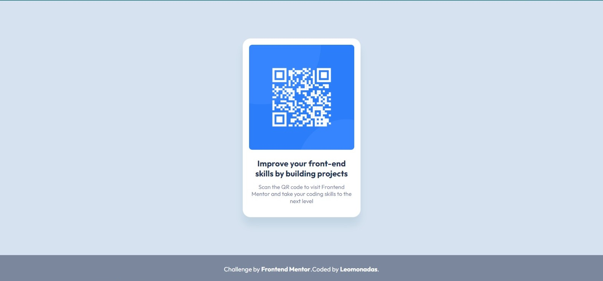

# Frontend Mentor - QR code component solution

This is a solution to the [QR code component challenge on Frontend Mentor](https://www.frontendmentor.io/challenges/qr-code-component-iux_sIO_H). Frontend Mentor challenges help you improve your coding skills by building realistic projects. 

### Screenshot

### Links

- Live Site URL: [Add live site URL here](https://your-live-site-url.com)

### Built with

- Semantic HTML5 markup
- SCSS
- Flexbox

## Author
<a href="https://github.com/leomonadas">
 
  
 <b>Leonardo Alves</b></a> <a href="https://github.com/leomonadas" title="GitHub">🚀</a>

- LinkedIn - [Leonardo Alves](https://www.linkedin.com/in/leonardo-alves-lima/)
- Behance - [@leomonadas](https://www.behance.net/leomonadas)

